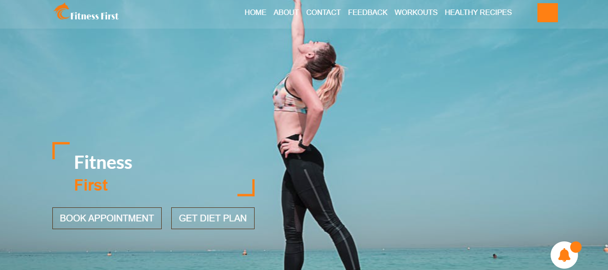

# Fitness-Forward: Empowering Women's Wellness
Welcome to the official project outline for our new women's health and fitness platform.
Our mission is to create a supportive, empowering and informative space for women to achieve their wellness goals, 
whatever they may be. 
We're moving beyond the basics to build a comprehensive resource for a healthy body and mind.

# Key Features  of Fitness First Website
1. Tailored Workout Programs: A diverse library of free workouts designed for women, including gym routines, at-home exercises, yoga, and strength training for all fitness levels. 
2. Nourishing Recipes & Meal Plans: A collection of delicious, healthy, and easy-to-prepare recipes to fuel your body and complement your fitness journey.
3. Expert Consultations: Connect online with certified fitness trainers, nutritionists, and women's health specialists for professional guidance.
4. Personalized Wellness Plans: Get a customized diet and workout plan based on your specific goals, lifestyle, and preferences.
5. Community & Support Hub: Engage with a vibrant community of like-minded women. Share your progress, ask for advice, and find motivation in a safe and positive environment.
6. Resource & Learning Center: Access a wealth of articles and expert advice on topics crucial to women's health, from fitness tips and mental well-being to nutritional guidance.

